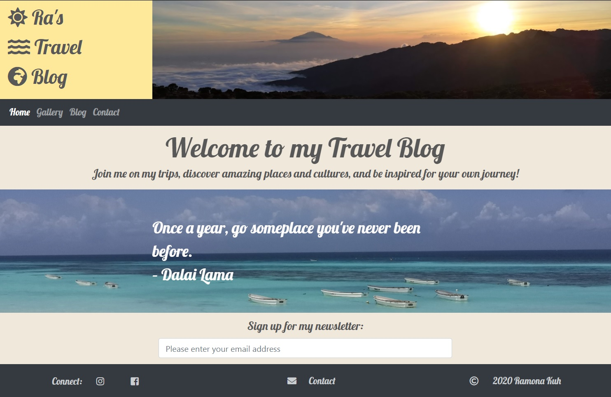
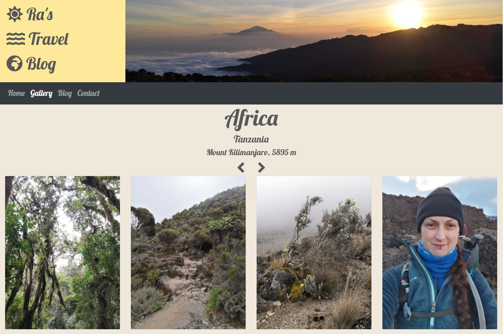
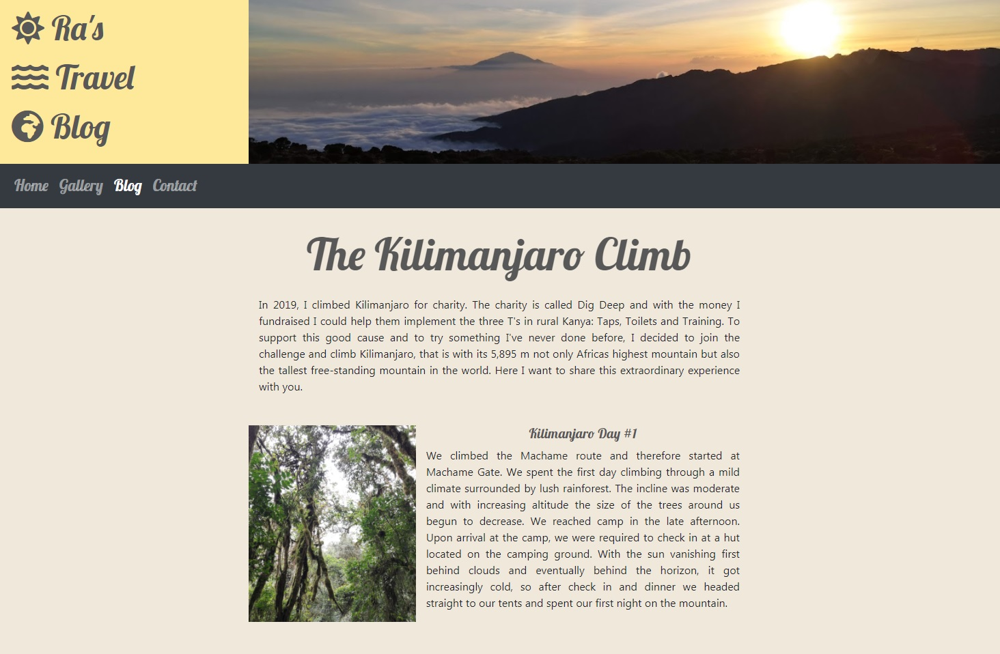
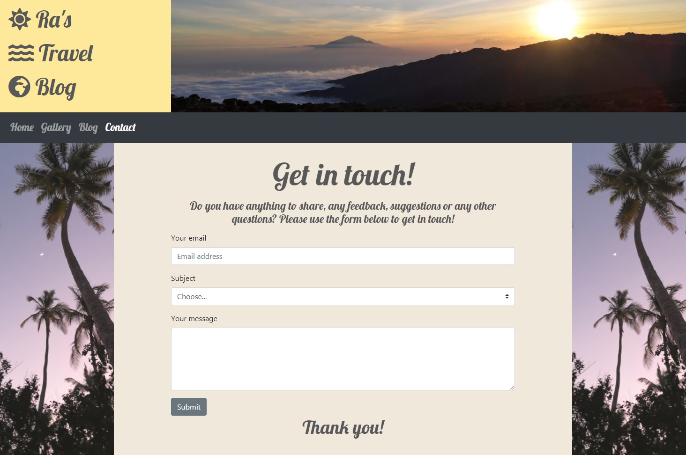
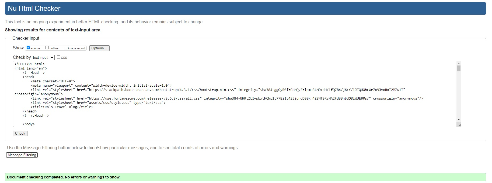
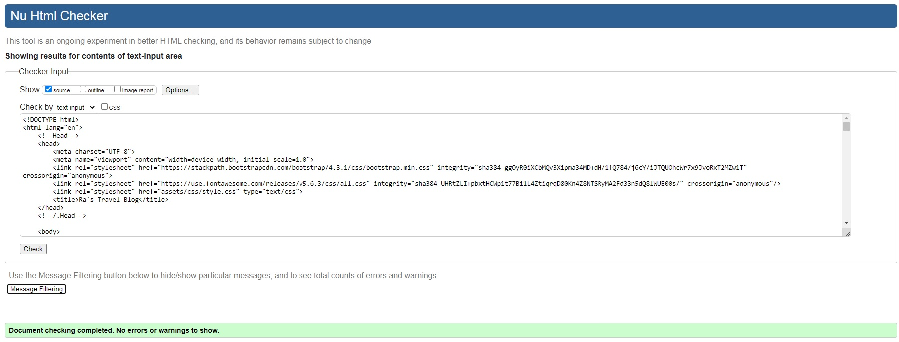
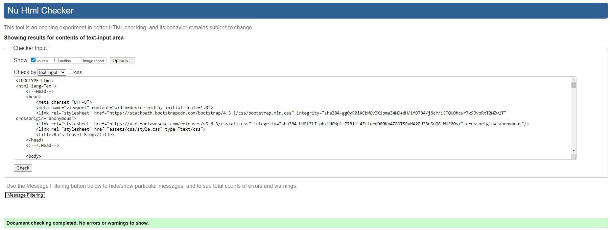
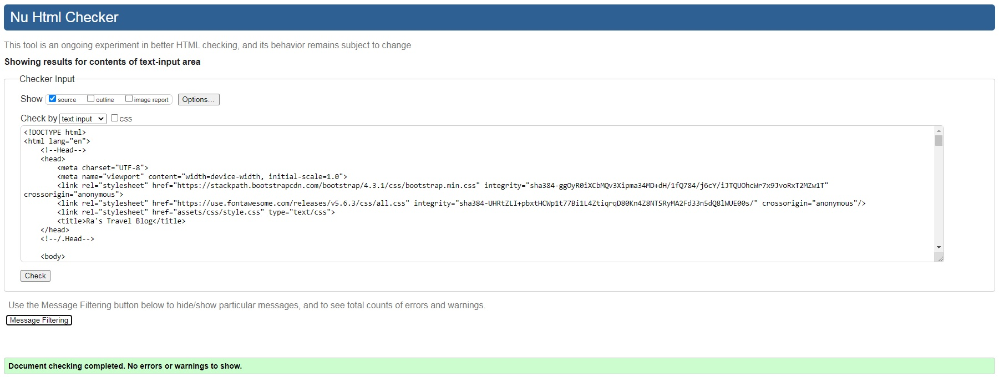
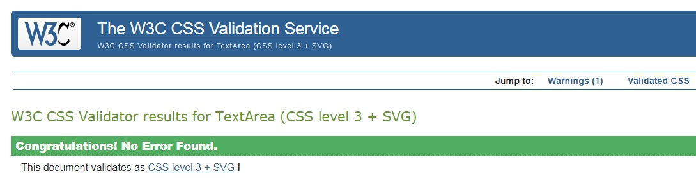

#   Ra's Travel Blog

[View the live project here.](https://z03y.github.io/travel-blog/blog.html)

This is my travel blog. Its purpose is to present pictures of my trips and share the stories of my journeys in a visually appealing way. It is designed to be responsive and works
on devices of various sizes. 

##  Home:
<h2 align="center"></h2>

##  Gallery:
<h2 align="center"></h2>

##  Blog:
<h2 align="center"></h2>

##  Contact:
<h2 align="center"></h2>

## User Experience (UX)

-   ### User stories

    -   #### First Time Visitor Goals

        1. Understand the main purpose of the site
        2. Easily navigate through the site
        3. Get inspired about traveling

    -   #### Returning Visitor Goals

        1. View and get inspired about trips by pictures
        2. Read and get inspired about trips by blog posts 
        3. Find a way to get in touch with the developer of the site
        4. Find social media links of the developer of the site

    -   #### Frequent User Goals

        1. View pictures that may have been added since the last visit
        2. Read blog posts that may have been added since the last visit
        3. Sign up to the newsletter to het notified about updates

-   ### Design

    -   #### Colour Scheme
        -   Warm pastel colors in the beige - yellow spectrum and a dark grey for the nav bar, footer, and smaller text pieces like headings have been used.

    -   #### Typography
        -   The Lobster font is the main font for all styled text on the site that is designed to catch the user's attention or look appealing in its context, with Cursive
            as fallback. The font for forms and larger chunks of text is Quicksand with Sans Serif as fallback.

    -   #### Imagery
        -   The hero image is designed to catch the user's attention and create a warm feeling of wanderlust. On the home page, the background image behind the inspirational 
            quote fullfils the same purpose. The gallery section consists mainly of images, whereas the images in the blog section serve as a visual attribute to the blog posts.

*   ### Wireframes

    -   Home Page Wireframe - [View](https://github.com/)

    -   Mobile Wireframe - [View](https://github.com/)

    -   Contact Us Page Wireframe - [View](https://github.com/)

## Features

-   Responsive on all device sizes

-   Interactive gallery

## Technologies Used

### Languages Used

-   [HTML5](https://en.wikipedia.org/wiki/HTML5)
-   [CSS3](https://en.wikipedia.org/wiki/Cascading_Style_Sheets)

### Frameworks, Libraries & Programs Used

1. [Bootstrap 4.4.1:](https://getbootstrap.com/docs/4.4/getting-started/introduction/)
    - Bootstrap was used to assist with the responsiveness, styling and layout of the website.
1. [Google Fonts:](https://fonts.google.com/)
    - Google fonts were used to import the 'Lobster' and 'Quicksand' fonts into the style.css file.
1. [Font Awesome:](https://fontawesome.com/)
    - Font Awesome icons were used throughout the website for aesthetic and UX purposes.
1. [jQuery:](https://jquery.com/)
    - jQuery came with Bootstrap to support the responsiveness of its features.
1. [Git](https://git-scm.com/)
    - Git was used for version control by utilizing the Gitpod terminal to commit to Git and push to GitHub.
1. [GitHub:](https://github.com/)
    - GitHub is used to store the project code.
1. [Balsamiq:](https://balsamiq.com/)
    - Balsamiq was used to create the [wireframes](https://github.com/) during the design process.

## Testing

The W3C Markup Validator and W3C CSS Validator Services were used to validate every page of the project to ensure there were no syntax errors in the project.

-   [W3C Markup Validator](https://validator.w3.org/#validate_by_input) - Results:
    -   Home:
    <h2 align="center"></h2>
    -   Gallery:
    <h2 align="center"></h2>
    -   Blog:
    <h2 align="center"></h2>
    -   Contact:
    <h2 align="center"></h2>

-   [W3C CSS Validator](https://jigsaw.w3.org/css-validator/#validate_by_input) - Results:
    <h2 align="center"></h2>

### Testing User Stories from User Experience (UX) Section

-   #### First Time Visitor Goals

    1. Understand the main purpose of the site:

        1. Upon entering the site, users are greeted with a page title, hero image, and an inspirational quote to convey the main purpose of the site. 
        2. An easily readable navigation bar allows the user to explore all available content with just one click, or, for users on devices with small screen sizes, two taps via the dropdown menu.

    2. Easily navigate through the site:

        1. Each page contains a consistent nav bar with links to all pages of the site.
        2. The title of the page on the top, also consistent across all sites, always leads back to the home page.
        3. On the home and contact pages, after signing up for the newsletter and submitting a form respectively, the page refreshes to the respective same page with a clean form.

    3. Get inspired about traveling:

        1. A hero image and an inspiring quote on the home page awake a sense of wanderlust.
        2. The heavy use of images on the site create a desire to see more and inspire the user to consider the destinations for their own journeys.

-   #### Returning Visitor Goals

    1. View and get inspired about trips by pictures:

        1. The gallery page clearly separates various picture gallerys based on their location.
        2. The interactive gallery allows the user to either lean back and watch the pictures change by itself or to take action and go through the pictures at their own speed.

    2. Read and get inspired about trips by blog posts:

        1. The blog page contains various blog posts about one trip, clearly structured by day.
        2. These blog posts are introduced by a short text to explain the background and purpose of the trip.
        3. The user is inspired to await more context through the "Stay tuned" message at the bottom of the page.

    3. Find a way to get in touch with the developer of the site:

        1. The nav bar contains a clearly named link to the Contact page, which leads to a contact form with a subject drop-down menu.
        2. Alternatively, the user can scroll to the bottom of any page to a link to the Contact page (on medium and larger devices only).

    4. Find social media links of the developer of the site:

        1. In the footer which is consistent on each page contains users can find links to the main social media pages of the developer on all screen sizes.

-   #### Frequent User Goals

    1. View pictures that may have been added since the last visit:

        1. The user would already be comfortable with the website layout and can easily click the gallery link.

    2. Read blog posts that may have been added since the last visit

        1. The user would already be comfortable with the website layout and can easily click the blog link.

    3. Sign up to the newsletter to het notified about updates:

        1. At the bottom of the home page, which on large devices is visible at first glance, the user can find a newsletter sign up field.

### Further Testing

-   The website was tested on Google Chrome, Firefox and Microsoft Edge browsers.
-   The website was viewed on a desktop, a laptop, and on HonorView 20 (Android).
-   Manual testing using the chrome web developer tool was done to ensure the intended functionality and responsiveness work on devices of all sizes.
-   Manual testing was done to ensure that all pages were linking correctly.
-   Friends and family members were asked to review the site to point out any bugs and/or user experience issues.

### Known Bugs

-   On the gallery page, pictures in portrait and landscape orientation appear in different sizes, causing the general content of the page to jump around when the carousel moves on to the next slide.
    -   This may cause the user to have to scroll back to center the pictures they were viewing, or to have to move the mouse pointer back to the "next slide" indicator.

### Planned Features

-   General:
    -   Turn page title "Ra's Travel Blog" into a text overlay over the hero image as background
    -   Add several more pages: 
        -   About: introduction to the developer
        -   Traveling Solo: tips for safe solo traveling, especially for women, trans and non-binary people
        -   Gear and Equipment: tips and recommendations for useful gear and equipment
        -   Reviews: reviews of visited places

-   Gallery:
    - At the top of the page, add a filter function for the user to select pictures for a specific trip or destination
    - Make pictures clickable, and let them increase in size into a nearly full screen overlay upon clicking
    - Add more slides to existing carousels and more carousels for more destinations

-   Blog:
    - At the top of the page, add a filter function for the user to select pictures for a specific trip or destination
    - Add more content, first for other trips already in the gallery, then for more trips to be added

## Deployment

### GitHub Pages

The project was deployed to GitHub Pages using the following steps:

1. Log in to GitHub and open the [GitHub Repository](https://github.com/Z03Y/travel-blog).
2. At the top of the Repository (not top of page), locate and click the "Settings" button.
3. Scroll down and locate the "GitHub Pages" Section.
4. Under "Source", click the dropdown called "None" and select "Master Branch".
5. Click save and wait a moment for the page to be generated.
6. Scroll back down to the "GitHub Pages" Section and click the link to the published page [link](https://z03y.github.io/travel-blog/).

### Forking the GitHub Repository

The GitHub Repository can be forked to make a copy of the original repository to view and/or make changes without affecting the original:

1. Log in to GitHub and open the [GitHub Repository](https://github.com/Z03Y/travel-blog).
2. At the top of the Repository (not top of page), locate the "Fork" Button.

### Making a Local Clone

1. Log in to GitHub and open the [GitHub Repository](https://github.com/Z03Y/travel-blog).
2. In the repository name, locate the "Code" button and click it to open the dropdown selection.
3. Select either HTTPS, SSL or GitHub CLI and click the button next to the link.
4. Open Git Bash
5. Change the current working directory to the location where you want the cloned directory to be made.
6. Type `git clone`, paste the URL you copied in Step 3, and press Enter.

## Credits

### Code

-   [Bootstrap4](https://getbootstrap.com/docs/4.4/getting-started/introduction/): The Bootstrap Library was used throughout the project mainly for responsiveness and layout of the content via its grid system.

-   [Bootstrap Carousel](https://mdbootstrap.com/plugins/jquery/gallery/#carousel-1): The code for the Bootstrap Carousel was used and adapted in the gallery page.

-   The code snippet to create responsive line breaks in the header was found [here](http://v3.danielmall.com/articles/responsive-line-breaks/).

### Content

-   All content was written by the developer, except for the quote.

-   The quote on the home page was found [here](https://www.earthtrekkers.com/best-travel-quotes-images/).

### Media

-   All Images were created by the developer.

### Documentation

-   The README file was created based on the SampleReadme provided by CodeInstitute found [here](https://github.com/Code-Institute-Solutions/SampleREADME).

### Acknowledgements

-   My Mentor for continuous helpful feedback.

-   Tutor support at Code Institute for their support.